# Release Notes v2.6

- [Variation info panel changes](#variation-info-panel-changes)
- [Customizable fields list in VCF info table](#customizable-fields-list-in-vcf-info-table)
- [Automatic downloading of variation info from dbSNP](#automatic-downloading-of-variation-info-from-dbsnp)
- [BLAT search](#blat-search)
- [Extend allowed location formats](#extend-allowed-location-formats)
- [Show full file name on a track header](#show-full-file-name-on-a-track-header)
- [Support for VCF files as annotations](#support-for-vcf-files-as-annotations)
- [Support for AWS S3 URI](#support-for-aws-s3-uri)
- [JWT Security](#jwt-security)
- [Add read group](#add-read-group)
- [Show exon number](#show-exon-number)
- [Changed file name view](#changed-file-name-view)
- [Changing allele frequency threshold setting behavior](#changing-allele-frequency-threshold-setting-behavior)
- [Working with tracks](#working-with-tracks)
    - [Tracks selection](#tracks-selection)
    - [Tracks renaming](#tracks-renaming)
    - [Resize tracks height](#resize-tracks-height)
    - [Customize the font size of track label](#customize-the-font-size-of-track-label)
- [Enhancements for BigWig tracks](#enhancements-for-bigwig-tracks)
    - [BigWig display mode](#bigwig-display-mode)
    - [BigWig scaling mode](#bigwig-scaling-mode)
    - [BigWig track colors](#bigwig-track-colors)
- [BED track colors](#bed-track-colors)
- [Other](#other)
- [Bug fixes](#bug-fixes)

## Variation info panel changes

- Order of 'VISUALIZER' and 'INFO' tabs was changed,
- Description field with full variation location info was added to 'INFO' tab.

## Customizable fields list in VCF info table

Now it is possible to select displayable fields in VCF info table.

## Automatic downloading of variation info from dbSNP

Additional tab 'DbSNP' appears in Variation info panel if rsId in variation is specified.

This tab contains different information: Organism, Map to Genome Build, Variation class, etc. and a direct link to dbSNP database.

## BLAT search

BLAT is an annotation utility which allow user to efficiently search for a potential location of particular DNA sequence.
Now it is available within NGB.

- Currently, when user selects a read, "Blat Search" menu item appears.

- Once 'BLAT Search' menu item is clicked, panel named 'BLAT' with BLAT Search results opens.

- If user clicks a BLAT search's table row - NGB navigates to the specified region. The found region is highlighted within a local ruler space.

- Genome species registration/unregistration on NGB server with the help of cli was added.
- Possibility to add species to reference genome during genome registration was added. Possibility to add/remove species to/from registered reference was added as well.

Also, BLAT search feature allows to edit read sequence. After searching the changed sequence, the results will change accordingly.

## Extend allowed location formats

Several possible coordinate formats for chromosome navigation are added:

- chromosome - navigate to the whole chromosome
- start-end - navigate to region on current chromosome (only if chromosome already selected)
- location - place center of the screen to location on current chromosome (only if chromosome already selected)

## Show full file name on a track header

Previously, file name was not fully displayed on a track header.
Now users can see the full file name when they mouse over the track name on a track header.

## Support for VCF files as annotations

Now it is possible to attach VCF files as annotations to reference genomes using ngb-cli "add_ann|an" command.

## Support for AWS S3 URI

Files from S3 buckets may be viewed using S3 URI, e.g. `s3://bucket/test.vcf.gz`.

Now this feature works for BAM, BED, VCF, GENE files opened via URL (non registered files). NGB server uses default AWS credentials to access S3 buckets.

## JWT Security

NGB server API authentication is now performed with use of JWT Tokens.

- all requests to API without token will receive 401 status (not authorized),
- all requests to API with valid token will receive 200 status (everything OK).

## Add read group

Grouping of reads by "Read Group" was added.

## Show exon number

Users see the exon number when they mouse over the gene track only if "Transcript view: Expanded".

Exon count isn't shown for "Transcript view: Collapsed" mode.

## Changed file name view

Previously, after the opening of files from the NGB server or via the URL, their names were displayed as the full paths to the files. Now only file name is shown.

E.g.: `file.bam` instead of `http://servername/path/file.bam`.

## Changing allele frequency threshold setting behavior

Changed Allele Frequency threshold units from percentage to floating number (from 0.00 to 1.00).
Highlighting logic was modified:

- **Before**: "% of mismatches" <= "allele frequency threshold",
- **Now**: "% of mismatches" >= "allele frequency threshold".

## Working with tracks

### Tracks selection

In the current version, the ability to select multiple tracks to perform certain group actions (applicable to the selected track types) was implemented.

Tracks selection can be performed:

- via the checkbox for each track (near the track type):  
  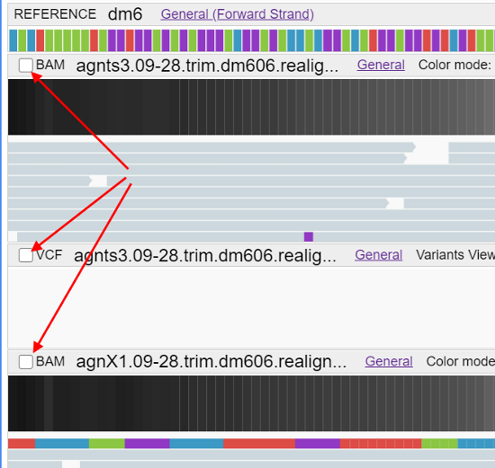
- or via the special "**Selection**" menu in the browser header:  
    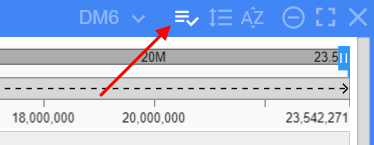  

    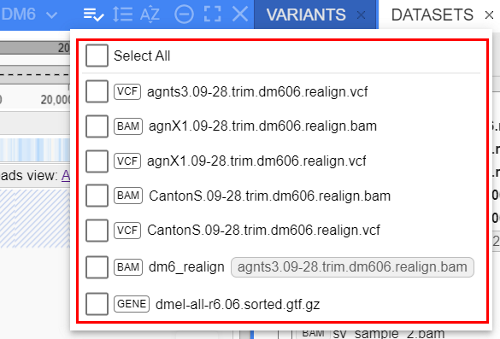

When at least 2 tracks are selected, on the top of tracks area, the additional floating menu appears - where group actions can be applied to the selected tracks:  
  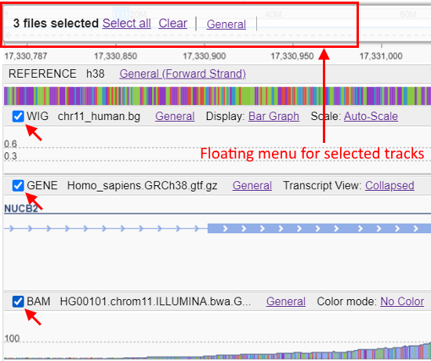  
If any action is selected in the floating menu - it will automatically being applied to the corresponding group of tracks.

For more details see [here](../../user-guide/tracks.md#tracks-selection).

### Tracks renaming

Now, users can rename any track in the browser:

1. Click the file name near the track type, e.g.:  
    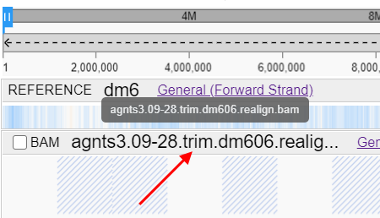
2. Specify a new track name you wish, e.g.:  
    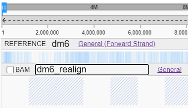
3. New specified name will be displayed for the current track:  
    

After the track is renamed, you can see the new name and the original one near it:  
    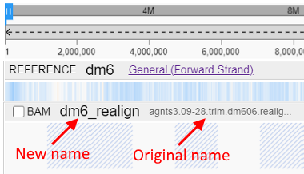

Once the track is renamed - the new name will be stored in the session. So the next time the track is loaded – the settings are restored.

For more details see [here](../../user-guide/tracks.md#tracks-renaming).

### Resize tracks height

Previously, NGB allowed to change the tracks height only individually using the “drag-and-drop” method.  

In the current version, the ability to change the track height size in pixels (individually or for a group of tracks) was implemented:

1. To the **General** control in the track header, the **Resize** item was added:  
  
2. In the popup, users can specify the height of the track in pixels:  
  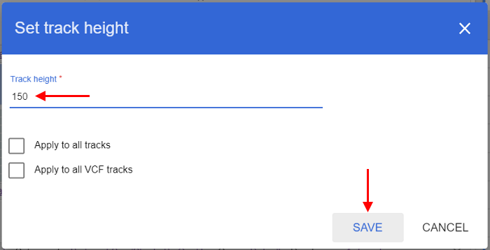
3. The track will be resized according to the set height:  
  

Also, you can manage the height for a group of selected tracks. For that, use the **General** -> **Resize** items in the [floating menu](#tracks-selection) of selected tracks:  
    

For more details see [here](../../user-guide/tracks.md#resize-tracks-height).

### Customize the font size of track label

In the current version, users can change the font size of track labels (individually or multiple at a time)

For that:

1. To the **General** control in the track header, the **Font size** item was added:  
  
2. In the popup, users can specify the font size (in `px`) for the track label:  
  
3. The track label font size will be changed according to the set value:  
  

Also, you can manage the label font size for a group of selected tracks. For that, use the **General** -> **Font size** items in the [floating menu](#tracks-selection) of selected tracks:  
    

For more details see [here](../../user-guide/tracks.md#customize-the-font-size-of-track-label).

## Enhancements for BigWig tracks

### BigWig display mode

From the current version, NGB supports "_Bar Graph_" (default) and "_Heat map_" display modes for `BigWig` tracks.

If a "Bar Graph" display option is chosen – each `BigWig`’s coordinate is being shown as the bar, depending on the locus "value".  
If a "Heat Map" display option is chosen – each `BigWig`’s coordinate is being shown with different color intensities, depending on the locus "value".

To change the display mode use the **Display** hyperlink in the `BigWig` track header:  
  

  

To set the display mode for a group, select several `BigWig` tracks and click the **Display** item in the [floating menu](#tracks-selection) of selected tracks:  
  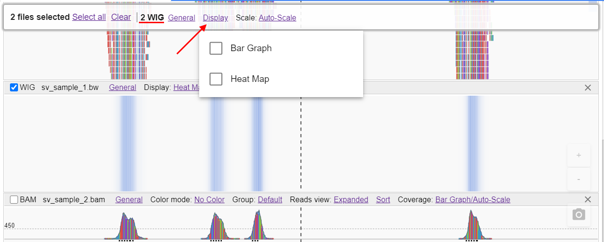

For more details see [here](../../user-guide/tracks-wig.md#display-mode).

### BigWig scaling mode

NGB supports several scale modes for the `BigWig` tracks: **Auto-Scale** / **Manual Scale**, and also for both types the **Log Scale** can be applied additionally.

**Manual** scale option allows to set the absolute scale range for the track.  
**Auto** scale option calculates the displayed data range automatically and apply this range to the track.  
**Log** scale option allows to set logarithmic scale for the track.

To change the scale mode for the `BigWig` track use the **Scale** control in the track header:  
    

Also, the ability to change the scale mode for a group of `BigWig` tracks was implemented. To set the scale for a group, select several `BigWig` tracks and click the **Scale** item in the [floating menu](#tracks-selection) of selected tracks:  
    

There is an additional mode for a group of `BigWig` tracks that can be set - **Group Auto** scale.  
**Group Auto** scale option - for all selected tracks simultaneously - calculates the common displayed data range automatically and apply it for all tracks.  
`BigWig` tracks with  the **Group Auto-scale** are being colored with special indicator (near the scale axis) to let the user know which tracks have the same range applied:  
    

For more details see [here](../../user-guide/tracks-wig.md#scale-mode).

### BigWig track colors

In the current version, the ability to change the `BigWig` track colors (depending on the value - positive/negative) was implemented.

To customize colors of the `BigWig` track, use the **Color** item from the **General** control in the track header:  
      
Select the color panel you wish to change and pick a color within the special control:  
      
      
Color changes will be applied:  
    

Also, you can manage the colors for a group of selected `BigWig` tracks. For that, use the **General** -> **Color** items in the [floating menu](#tracks-selection) of selected tracks:  
      
In such case, the set color scheme will be applied to all selected `BigWig` tracks:  
      
    

For more details see [here](../../user-guide/tracks-wig.md#track-colors).

## BED track colors

In the current version, the ability to change the `BED` track color (depending on on the "feature" type) was implemented.

To customize colors of the `BED` track, use the **Color** item from the **General** control in the track header:
      
Select the color panel you wish to change and pick a color within the special control:  
      
    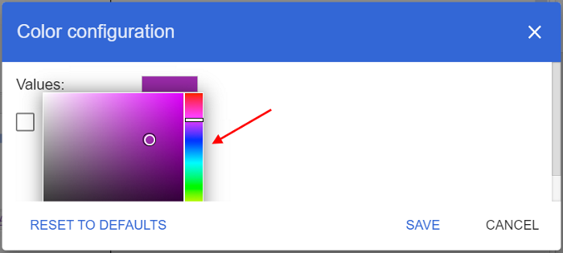  
Color changes will be applied:  
    

Also, you can manage the colors for a group of selected `BED` tracks. For that, use the **General** -> **Color** items in the [floating menu](#tracks-selection) of selected tracks:  
      
In such case, the set color scheme will be applied to all selected `BED` tracks:  
    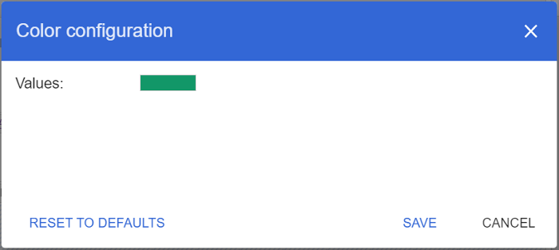  
    

For more details see [here](../../user-guide/tracks-bed.md#track-colors).

***

## Other

### Display reference letters in BAM coverage graph using gray color

Previously, on the BAM coverage window NGB displayed coverage in gray only if ALL letters at this position were the same as in reference. If there were any mismathes, NGB displayed each letter in their own color.

Currently, if there are mismatches and a letter at this position is the same as in reference (not a variation), then it will be displayed in gray color on a BAM coverage graph.

### API method timeouts

When NGB receives too many "huge" requests, it tries to fulfil them all. This results into loss of responsiveness for minutes/hours for all users.
We introduced timeouts for the API methods. If a request can not be fulfilled in a certain amount of time - HTTP 503 will be returned.

This is the list of API methods that have timeouts:

- `/filter`
- `/filter/group`
- `/reference/loadAll`
- `/project/tree`
- `/bam/track/get`
- `/gene/{id}/track/get`
- `/wig/track/get`
- `/vcf/track/get`

Timeout setting is defined in app.properties with default value 10 sec.

### Improve performance when load large vcf files into "Variations table"

In this release we have improved performance of loading large vcf "Variations table".

### Add quality field to the "Variations table"

Now it is possible to add the quality field to the "Variations table".

### Show vcf file name within a "Variations table"

Field "Source File" was added to "Variations table" menu, which is hidden by default.

If user enables "Show filters" option and adds this column to the "Variations table", they can choose variations from particular vcf files.

### Rebuild full feature index directory

Previously, `ngb index_file` rebuilt only lucene index. But in some cases it is useful to regenerate all other index stuff. E.g. histograms, bound for genes files.

Currently, `ngb index_file` rebuilds full feature index directory. In addition, this command now accepts `--no-tabix` option. When this option is set - .tbi index will not be rebuilt.

### JS API

Currently, the following operations are exposed as JavaScript API:

1. Load dataset (by ID),
2. Load track (by ID or URL/Path - same options as available from GUI),
3. Navigate to coordinate (accepts different coordinate formats),
4. Set track options (according to track type, e.g. Collapsed/Expanded, Coloring mode, etc.),
5. Set global settings (that are available via "Settings" menu in the left toolbar).

Documentation is available at - docs/md/user-guide/embedding-js.md.

Additional API response was added - `{ isSuccessful: true, message: 'ready', }`, so now it's possible to determine the exact moment when NGB is ready to receive messages.

### Automatic Docker image creation via Travis

The publish.sh script was changed to allow automatic creation of the docker image from develop branch upon each commit.

Also, the script `demo_data_download.sh` was added to the `/docker/demo/` folder.
This script downloads reference fasta, gene files, demo data from `ngb.opensource.epam.com` and register them after the docker container launch.

### Optimize URL browsing performance

Previously, browsing files from URLs was rather slow.
Our current approach is to use cache to store indexes in memory, not to fetch them from URL on every request.

Server responses became faster than before when browsing files via URL.
Ability to enable/disable caching from the properties file was added.

### Update Installation Guide

[Installation guide](../../installation/overview.md) with NGB-CLI installation instructions was updated.

### Styling drag and scroll bar

Drag and scroll bar were made a little bit wider. Scroll bar in genes became more bright.

### Zoom button is moved

Zoom button was moved, so now it is easier to close tracks.

### Update track rendering

Seg track rendering and center line rendering for all tracks were updated.

***

## Bug fixes

### Add adaptive sizing for vcf info window

Previously, in VCF info table fields with too long names overlapped with data.

Now min-width for VCF info dialog is added. Also, adaptive sizing to VCF info table (for fields captions and for fields data) was added.

### Transcript fetch won't fail if any of entries isn't found in Uniprot DB

In order to build SV visualization we fetch the transcripts data from Ensembl and then for each transcript query Uniprot. Now if Uniprot entry for a transcript isn't found or any exception occurs, we proceed with the next transcript.

### File names overlap

Currently, files names do not overlap even though their length can be more than width of the rectangle on the main panel in case of multi BAM/VCF selection.

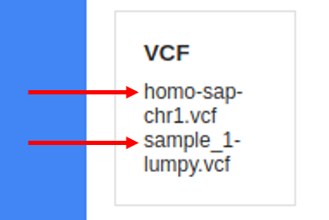

### Error loading variant info

Previously, the error "Error loading variant info" was shown in pop-up window when user clicked "Show Info" on a variation in cases when the variation was out of a gene (partly or fully).

Now variation info for such cases  is shown without specifying affected genes.

### Unable to reg vcf with idx file in the same directory

Fixed error when user can't register vcf file when idx index for this file is located in the same directory.

### Error when displaying reads

Previously, NGB did not display reads in cases when at least one read in BAM starts with soft clips and located near the beginning of reference, and at least one other is located near the end of reference.

For example, this BAM:

was displayed like this:

After narrowing down the scale and sending request again, reads were displayed.
However some of their bases were displayed as variations even though they were not.

Now both problems are fixed.
