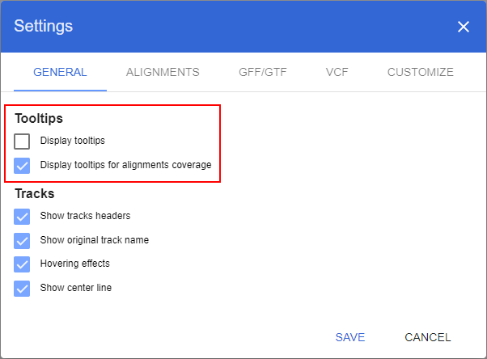
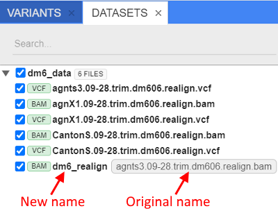
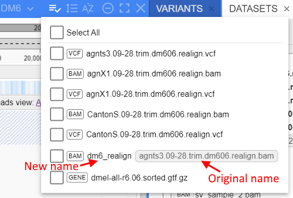
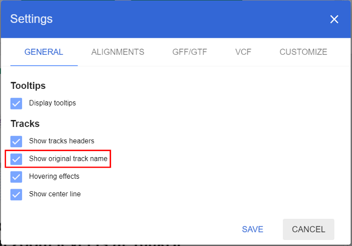
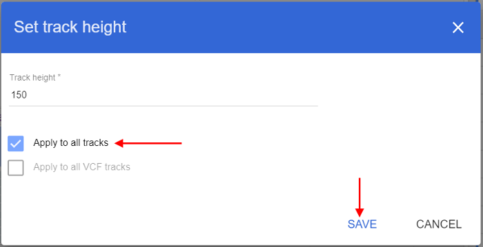
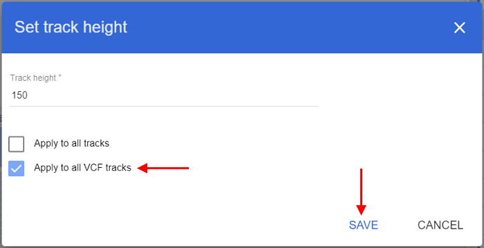
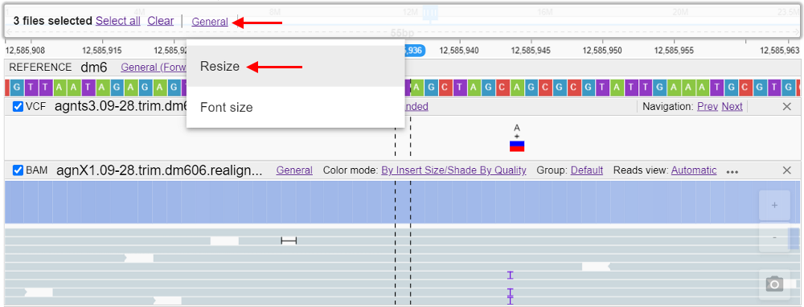
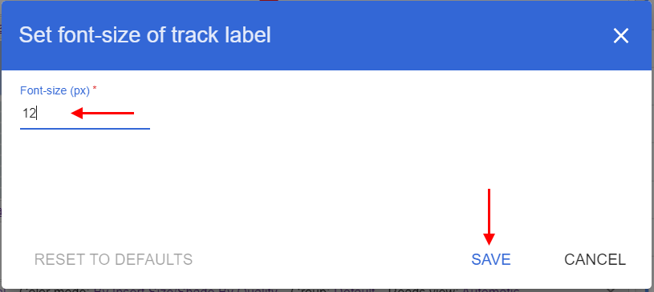
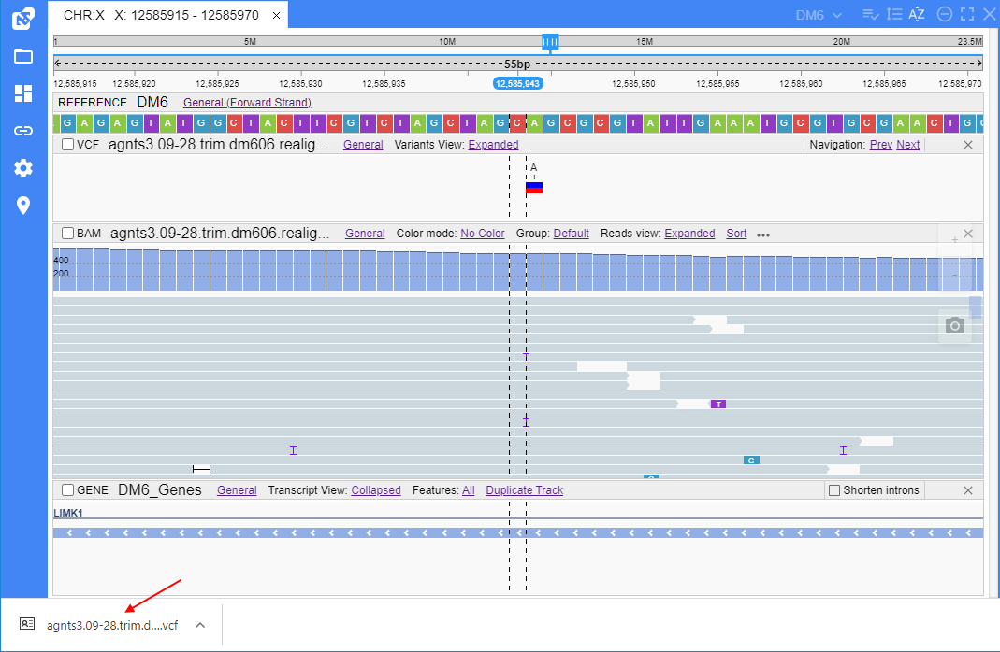

# Tracks

- [Navigating to a specific genome location](#navigating-to-a-specific-genome-location)
- [Tracks selection](#tracks-selection)
- [Tracks renaming](#tracks-renaming)
- [General control](#general-control)
    - [Resize tracks height](#resize-tracks-height)
    - [Customize the font size of track label](#customize-the-font-size-of-track-label)
    - [Download original file](#download-original-file)

## Navigating to a specific genome location

### Using the ruler

You can use the ruler to navigate inside a chromosome.

The ruler has two components:

* The **global ruler** always depicts the whole chromosome scale. The indicator shows the current position. To move a position, click and drag the icon in the middle of the range. To change the range's size, click and drag the indicator's edge(s).

* The **local ruler** depicts the range selected on the global ruler. Click and drag on the range to zoom in on it. A coordinate inside a blue bubble shows current position (that is in the center of the screen)

### Using zoom in/out buttons

To zoom in or out on tracks, you can use **+/-** buttons located in the upper right corner of the track view. The **+/-** buttons are transparent by default and become opaque when you hover over them.

### Using click-to-zoom

To zoom in on a specific location, double click (with a left mouse button) any place on a track.
This will zoom browser by one level (like clicking **+** button in the Zoom menu) and will place clicked coordinate to the center of the screen.

### Using scrolling on a track

When viewing a track, you can also use **Shift + mouse wheel scroll** to zoom in or out on that track.

### Using unified coordinates and search control

**Browser** panel tab's header contains **unified coordinates and search control** which consists of 2 user inputs:

* Chromosome selector dropdown at left of tab's header
* Coordinates and search input control at right of tab's header

To navigate to a region of interest, the following steps should be performed:

* Select a chromosome from the chromosome selector dropdown to open the whole chromosome scale in the Browser panel

* Type a chromosome's name and position of interest on a coordinates and search input control and press Enter on your keyboard to open a particular position. Supported formats of inputs are:
  * "Chromosome name" : "start" - "end", e.g 2: 29223634 - 29225485
  * "Chromosome name" : "position", e.g. X: 48054699

* Type a gene, transcript, feature or bookmarks name on a coordinates and search input control. Search results will be displayed at the list. To navigate to the region of a particular feature, click on a corresponding search result item:

### Viewing features info

There are two ways to view features for any track that contains them:

* **Hovering tooltip** By default, when hovering over a feature on the track, a tooltip with the feature info appears:

To disable this feature, click the **Settings** button in the top right corner of the window, open **General** menu, and untick the option **Display tooltips**. When **Display tooltips** is disabled, **Display tooltips for alignments coverage** could be managed optionally.

* **Modal popup window** To show feature info in a popup window (e.g. when tooltips are turned off), click the feature on the track and select **Show info** in the context menu.

The popup window will contain the same information as the tooltip plus the nucleotide sequence of the feature.

## Tracks selection

NGB supports the selection of multiple tracks to perform certain group actions (applicable to the selected track types).

Tracks selection can be performed:

- via the checkbox for each track (near the track type):  
  
- or via the special "**Selection**" menu in the browser header:
    - Click the corresponding button:  
    
    - Select desired tracks from the list:  
    

User can select one/several/all tracks (regardless their types).  
When at least 2 tracks are selected, on the top of tracks area, the additional floating menu appears - where group actions can be applied to the selected tracks:  
  

This menu contains, at least:

- label with the count of selected tracks
- **Select all** button - to select all displaying tracks in the Browser
- **Clear** button - to clear tracks selection and close the floating menu
- **General** sub-menu - the common list of configurations/actions that can be applied to all selected tracks:  
    
    - **Resize** item allows to change the tracks' height in pixels (for details see [here](#resize-tracks-height))
    - **Font size** item allows to change the track names' font size (for details see [here](#customize-the-font-size-of-track-label))

Also, if the only tracks of the same type are selected, there will be additional sub-menu(s) with corresponding type-specific configurations/actions in this floating menu. E.g., for [`WIG`](tracks-wig.md) tracks:  
  

**_Note_**: if the only tracks of the same type are selected, **General** sub-menu can have more items than only _Resize_ and _Font size_ - according to the specific track type.

If any action is selected in the described floating menu - it will automatically being applied to the corresponding group of tracks.

## Tracks renaming

User can rename any track in the browser.

For that:

1. Click the file name near the track type, e.g.:  
  
2. In the appeared field, specify a new track name you wish, e.g.:  
    
  
3. Press the _Enter_ key once the new name will be specified.
4. New specified name will be displayed for the current track:  
  

After the track is renamed, you can see the new name and the original one near it:

- at the track header:  
  
- in the **Datasets** panel:  
  
- in the **Selection** menu:  
  

The behavior (whether to show the original name) is being controlled via separate global NGB setting:  
  

**_Note_**: once the track is renamed - the new name will be stored in the session. So the next time the track is loaded – the settings are restored.

## General control

**General** sub-menu contains several items with actions that user can perform with a track.  
The list of these actions can differ according to the specific track type.  
But all tracks contain at least the following items (full description see below):

- _Resize_ - to resize a track height
- _Font size_ - to change a track header font size
- _Download_ - to download an original track file

### Resize tracks height

NGB allows to change the tracks height individually using the “drag-and-drop” method.  

Also, the track height size can be set manually in pixels.  
For that:

1. Click the **General** control in the track header:  
  
2. In the appeared list, click the **Resize** item:  
  
3. In the popup, specify the height of the track in pixels and confirm, e.g.:  
  
4. The track will be resized according to the set height:  
  
5. If you wish to set the same height for all tracks in the browser - return at step 3 and set the "**Apply to all tracks**" checkbox:  
  
6. If you wish to set the same height for all tracks of that type in the browser - return at step 3 and set the "**Apply to all {track_type} tracks**" checkbox:  
  

Also, you can manage the height for a group of selected tracks. For that, use the **General** -> **Resize** items in the [floating menu](#tracks-selection) of selected tracks:  
    
In such case, the set height will be applied only to selected tracks:  
  

### Customize the font size of track label

Users have the ability to change the font size of track labels (individually or multiple at a time).

For that:

1. Click the **General** control in the track header:  
  
2. In the appeared list, click the **Font size** item:  
  
3. In the popup, specify the font size (in `px`) for the track label and confirm, e.g.:  
  
4. The track label font size will be changed according to the set value:  
  
5. If you wish to set the same font size for all track labels in the browser - return at step 3 and set the "**Apply to all tracks**" checkbox.
6. If you wish to set the same font size for all track labels of that type in the browser - return at step 3 and set the "**Apply to all {track_type} tracks**" checkbox.

Also, you can manage the label font size for a group of selected tracks. For that, use the **General** -> **Font size** items in the [floating menu](#tracks-selection) of selected tracks:  
    
In such case, the set height will be applied only to selected tracks:  
  

### Download original file

Users have the ability to download an original file that was loaded for the track.
For that:

1. Click the **General** control in the track header:  
  
2. In the appeared list, click the **Download file** item:  
  
3. Download will start automatically:  
  
